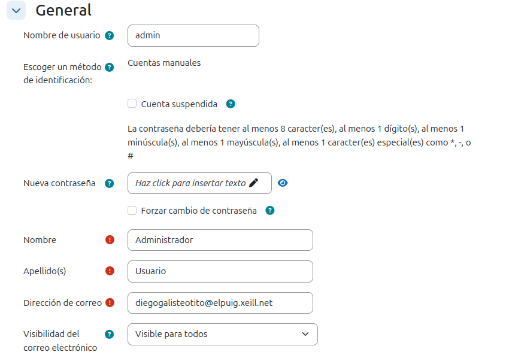

# Práctica-Tema-4 Instalació i Configuració de Moodle

## OBJECTIU

El objectiu d'aquesta práctica trata sobre fer un portal de moodle com vulguem sent els administradors.

## 1. Configuració de Moodle

## 1.1. Administració del perfil d'usuari
Ara anirem al perfil per poder canviar la contrasenya y el correu electrònic, li donarem a la nostra imatge a dalt a la dreta, li donem a preferències y després a editar perfil:

