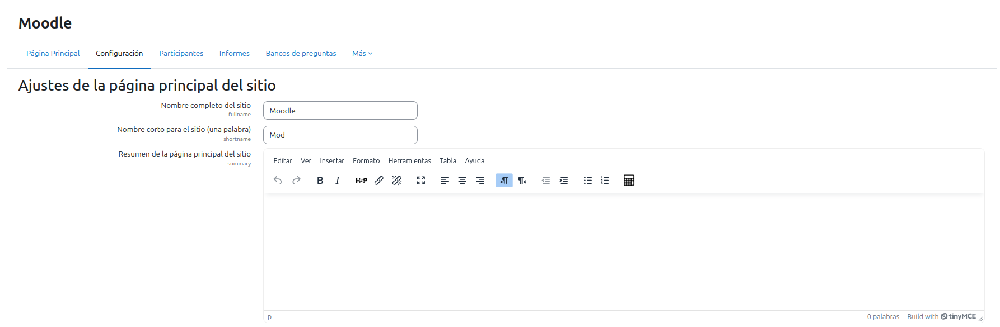
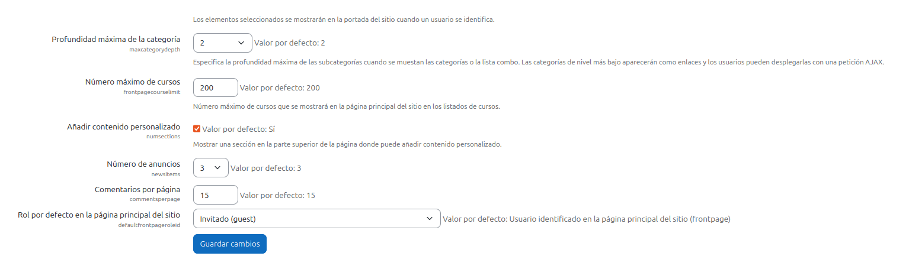
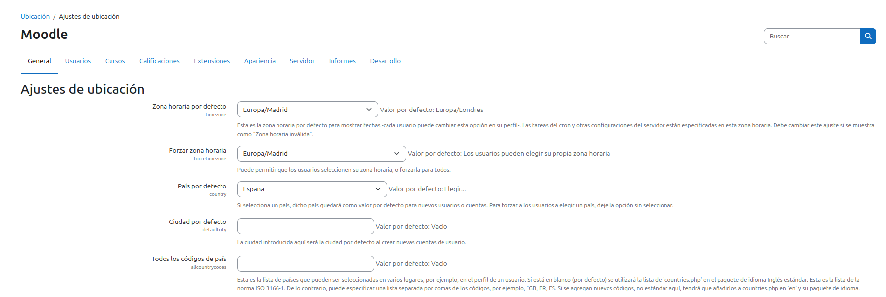
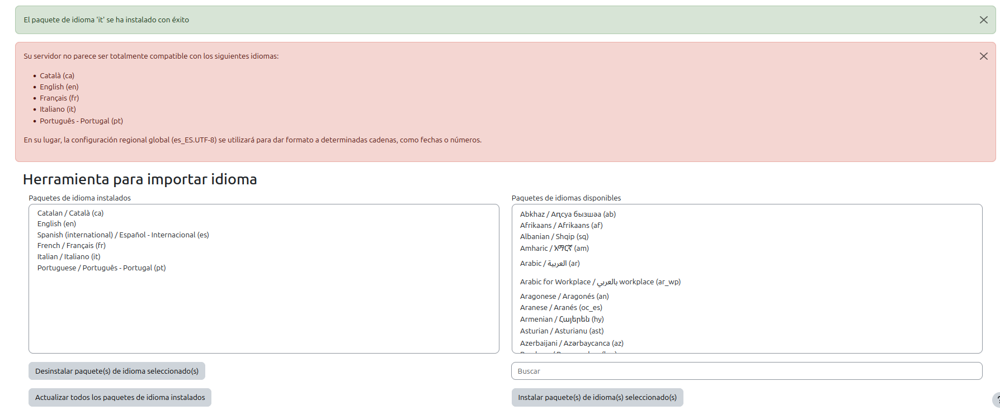
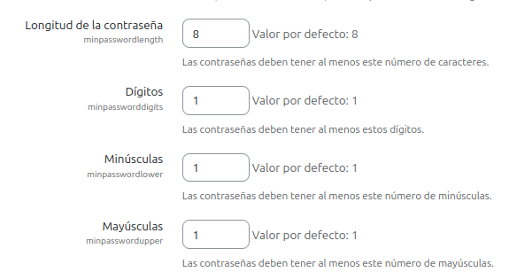
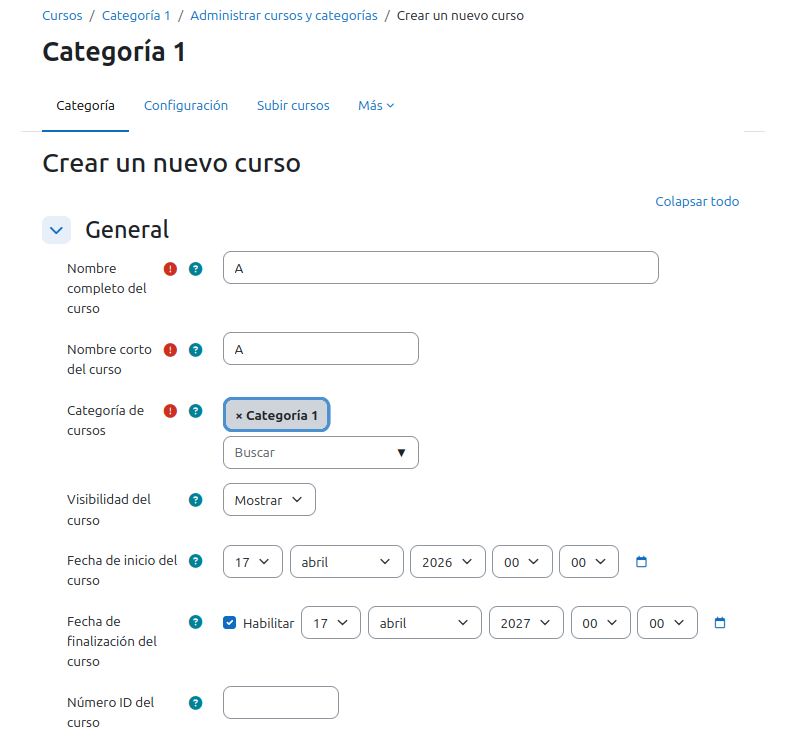
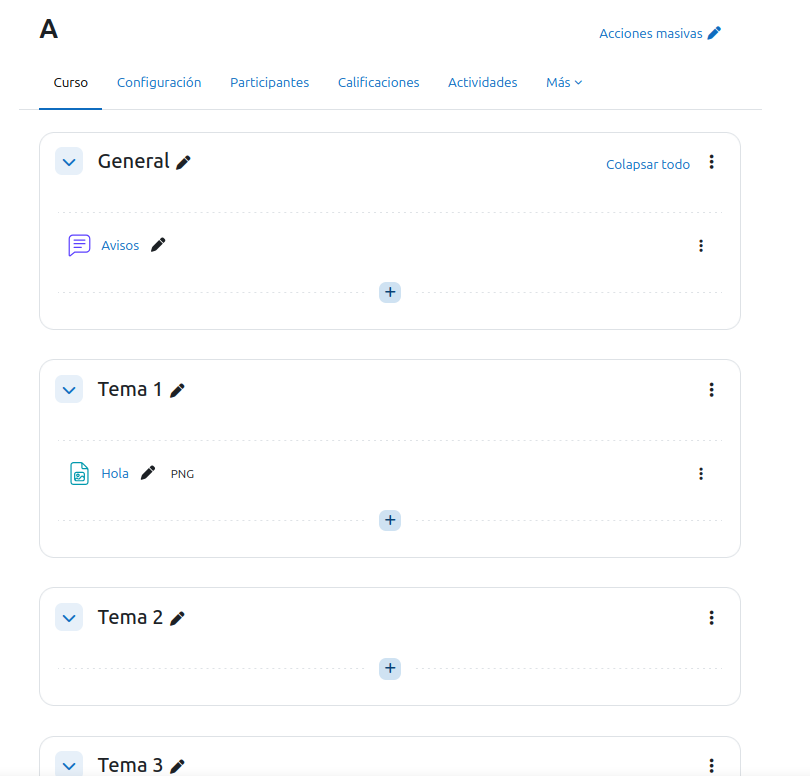
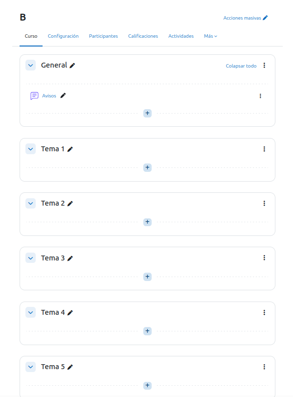

# Práctica-Tema-4 Instalació i Configuració de Moodle

## OBJECTIU

El objectiu d'aquesta práctica trata sobre fer un portal de moodle com vulguem sent els administradors.

## 1. Configuració de Moodle

## 1.1. Administració del perfil d'usuari
Ara anirem al perfil per poder canviar la contrasenya y el correu electrònic, li donarem a la nostra imatge a dalt a la dreta, li donem a preferències i després a editar perfil:

## 1.2. Configuració del lloc

Primer entrarem a administració del lloc a página principal del lloc a ajustaments de la página principal del lloc, una vegada a dins canviarem el nom del lloc web i el rol per defecte en la página principal del lloc per el d'invitat:

Després anirem a administració del lloc i buscarem ubicació, li donem a ajustaments de ubicació i posem la nostra franja horària correcta i li donem a guardar cambis:

En administració del lloc buscarem idioma i anirem a paquets d'idioma instalarem alguns paquets d'idioms el que vulguem on posa instalar paquets d'idiomes seleccionats:

Entrarem administració del lloc buscarem seguretat i a polítiques de seguretat del lloc, posem una longitud de contrasenya mínima de  8 caràcters, incloent majúscules, minúscules i números, i guardem cambis:

## 2. Creació de cursos

## 2.1 Creeu els següents cursos A i B 

Entreu en els meus cursos a crear curso i el modifiquem com vulguem:

## 2.2 Exploreu les opcions de personalització dels cursos

Ara editem els noms dels temes hauràn de ser 3 temes, i afegim alguna activitat o material, tot això el fem una vegada hem pressionat el botó de dalt a la dreta on posa mode d'edició: 

Farem lo mateix amb el curs B sol que aquest tindrà 5 temes en lloc de 3:

