# Práctica-Tema-4 Instalació i Configuració de Moodle

## OBJECTIU

El objectiu d'aquesta práctica trata sobre fer un portal de moodle com vulguem sent els administradors.

## 1. Configuració de Moodle

## 1.1. Administració del perfil d'usuari
Ara anirem al perfil per poder canviar la contrasenya y el correu electrònic, li donarem a la nostra imatge a dalt a la dreta, li donem a preferències i després a editar perfil:

## 1.2. Configuració del lloc

Primer entrarem a administració del lloc a página principal del lloc a ajustaments de la página principal del lloc, una vegada a dins canviarem el nom del lloc web i el rol per defecte en la página principal del lloc per el d'invitat:

Després anirem a administració del lloc i buscarem ubicació, li donem a ajustaments de ubicació i posem la nostra franja horària correcta i li donem a guardar cambis:

En administració del lloc buscarem idioma i anirem a paquets d'idioma instalarem alguns paquets d'idioms el que vulguem on posa instalar paquets d'idiomes seleccionats:

Entrarem administració del lloc buscarem seguretat i a polítiques de seguretat del lloc, posem una longitud de contrasenya mínima de  8 caràcters, incloent majúscules, minúscules i números, i guardem cambis:

## 2. Creació de cursos

## 2.1 Creeu els següents cursos A i B 

Entreu en els meus cursos a crear curso i el modifiquem com vulguem:

## 2.2 Exploreu les opcions de personalització dels cursos

Ara editem els noms dels temes hauràn de ser 3 temes, i afegim alguna activitat o material, tot això el fem una vegada hem pressionat el botó de dalt a la dreta on posa mode d'edició: 

Farem lo mateix amb el curs B sol que aquest tindrà 5 temes en lloc de 3:

## 3. Creació i gestió d'usuaris

## 3.1 Creació manual d'usuaris

Anirem a administració del lloc on posa usuaris i anirem a comptes on hi ha crear un nou usuari, una vegada hi estem allí rellenem les dades que ens demanen:

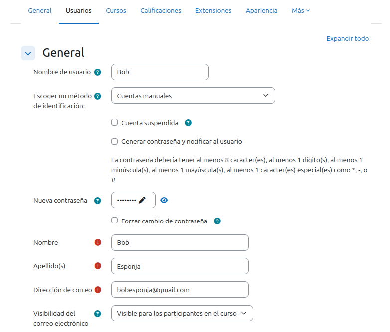

## 3.2 Creació massiva d'alumnes

Genereu 10 alumnes utilitzant un arxiu CSV a administració del lloc on posa usuaris a comptes a carrega usuaris, ens decarguem el example.csv i el editem, posem els noms, els cognoms i els correus electrónics. Quan hem acabat li donem a guardar, pujem l'arxiu i ens asegurem que estigui bé la configuració abans de donar-li a pujar usuaris:

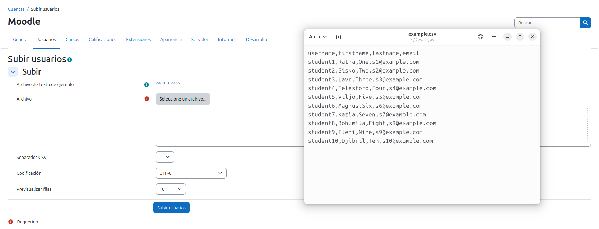

Es tendría que visualitzar així, també subim els usuaris i a continuar:

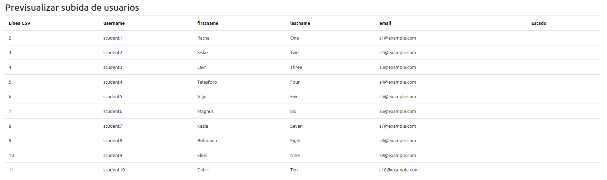

Ara eliminarem 2 alumnes a administració del lloc on posa usuaris a comptes a accions d'usuario massives, seleccionem 2 alumnes i a baix del tot elegim esborrar i després li donem a anar:

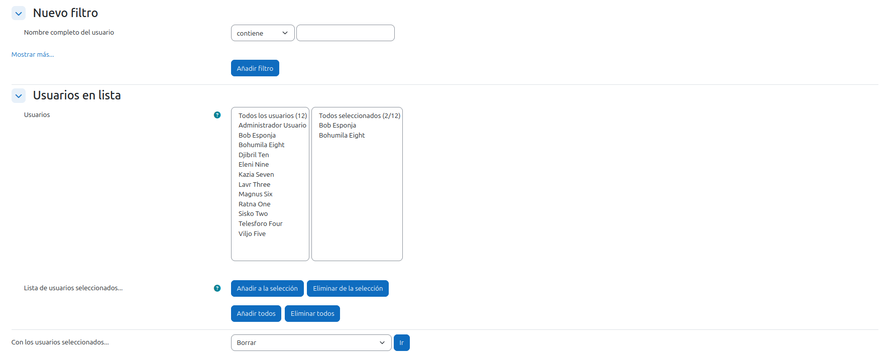

## 4. Matriculació d'usuaris als cursos

## 4.1 Configuració de mètodes d'inscripció

Al curs A desactiveu qualsevol mètode d'inscripció per fer-lo públic en mode d'edició a participants i on posa usuaris matriculats el cambiem per mètodes de matriculació:

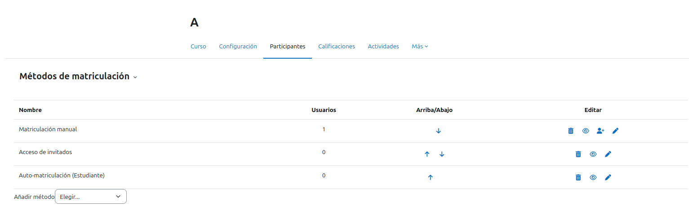

Al curs B activeu el registre manual d'usuaris (també en mètodes de matriculació) i matriculeu l'usuari Bob com a professor i els alumnes restants com a estudiants en usuaris matriculats a matricular usuaris a Bob li posem rol de profesor i als alumnes els de estudiants:

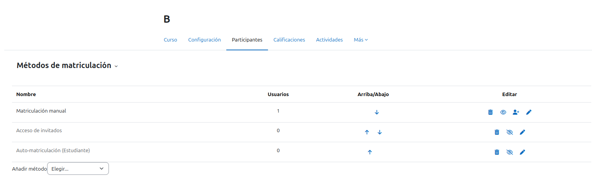

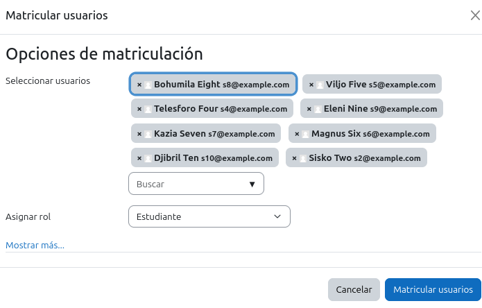

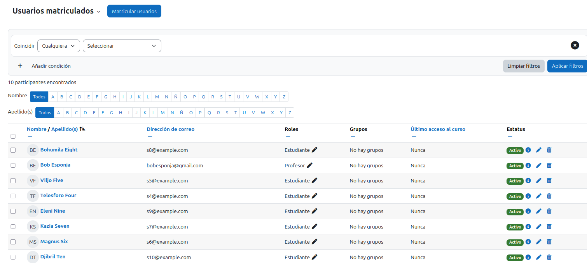

## 4.2. Verificació

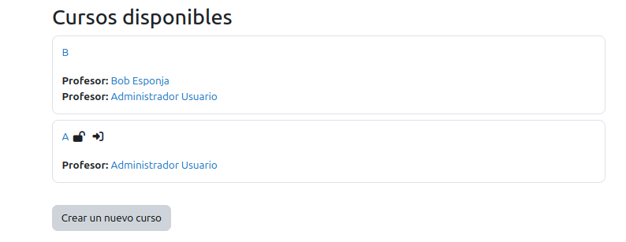

## 5. Personalització del lloc

## 5.1 Canvi d'aspecte

Anar a Administració del lloc a Connectors a Instal·lar complement y li donem a instalar complement des de el directori de moodle:

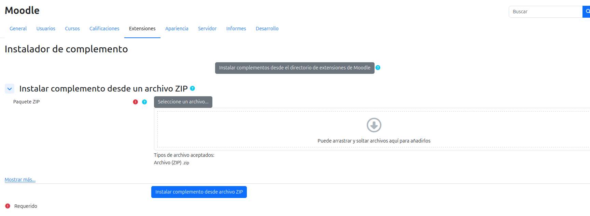

li donem a browse plugins instalem els plugins que vulguem després tornem al lloc d'abans, els subim i li donem a continuar tot:

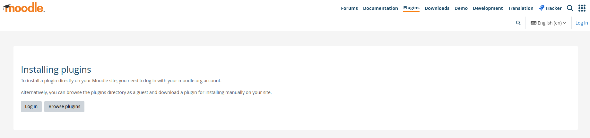

Seleccioneu el tema des de administració del lloc a aparença a temes i si vulguem el configurem com vulguem a l'engranatge del tema:

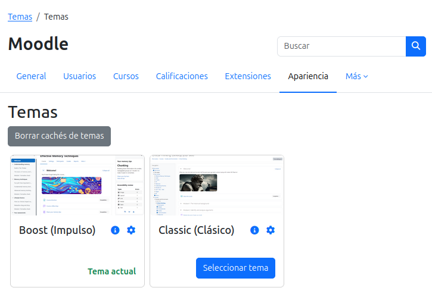

## 5.2 Logotip

Afegim un logotip a administració del lloc a aparença a logotips subim una imatge i gquan estiguem uardem cambis:

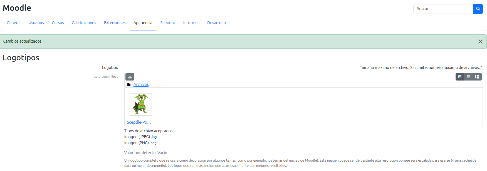

## 6. Creació de continguts i activitats

## 6.1 Curs A

Assigneu un professor i matriculeu alumnes al curs A com hem al B abans:

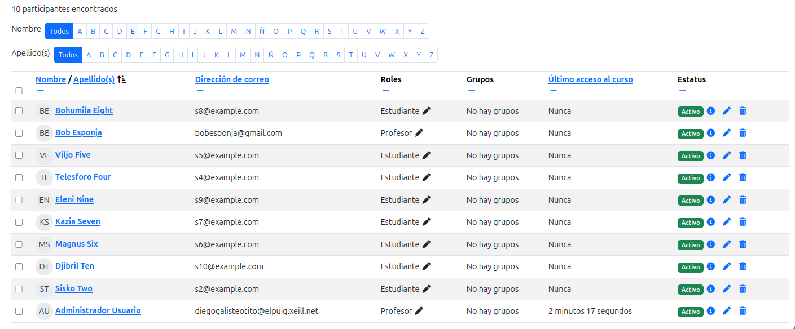

Ara anem a pujar varies activitats, recursos i una tasca amb data d'entrega oberta que demani la càrrega d'un fitxer PDF:

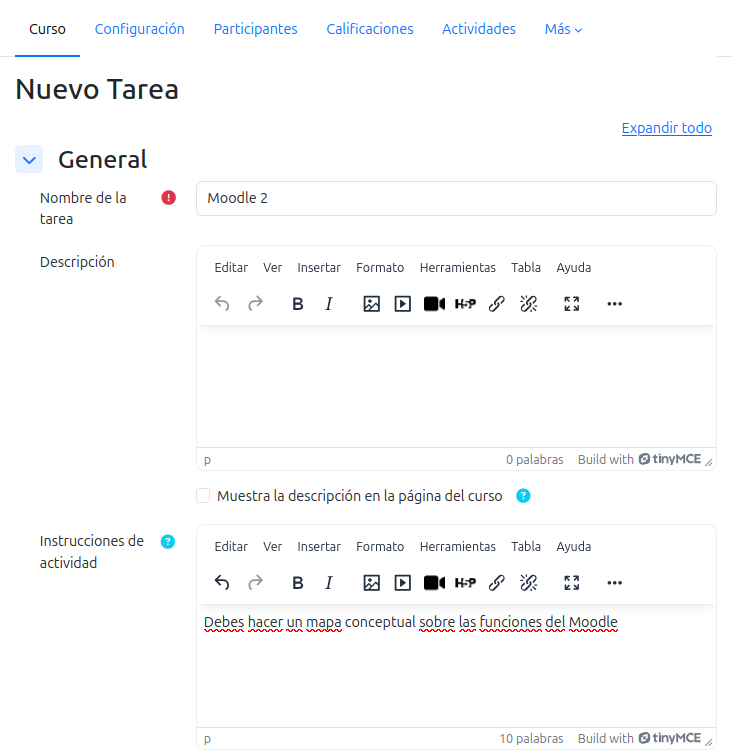

Després de posar el nom i les instruccions de la tasca, anirem a disponibilidad i posem una data de entrega desde avui i una de venciment quan vulguem, per últim posem en tipus d'arxiu arxius de document pdf i guardem cambis:

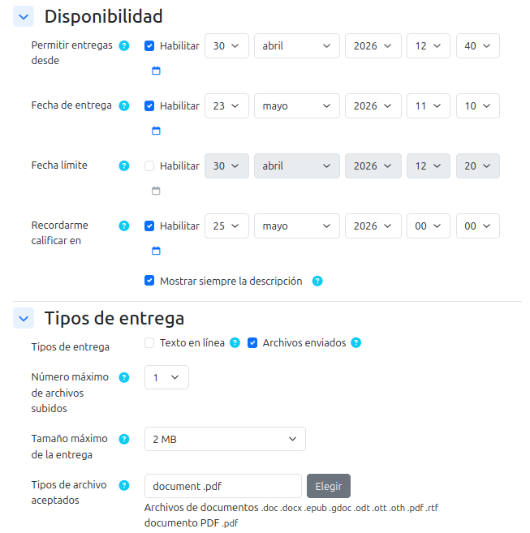

## 6.2 Curs B

Cloneu el contingut del curs A al curs B, anem al curs B a més a reutilització del curs a importar, seleccionem el curs A i li donem a continuar a tot:

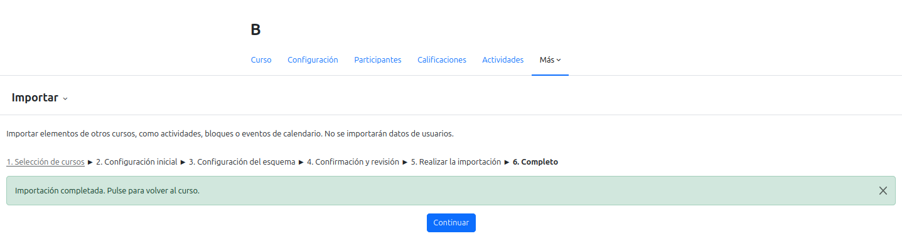

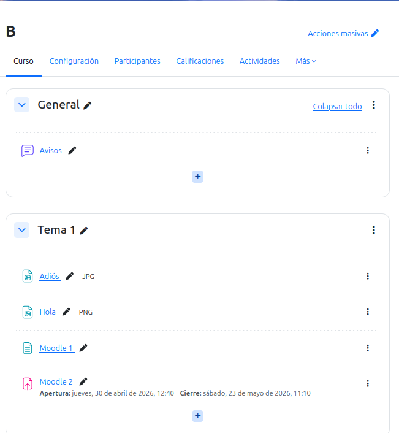

## 7. Qualificacions i insígnies

